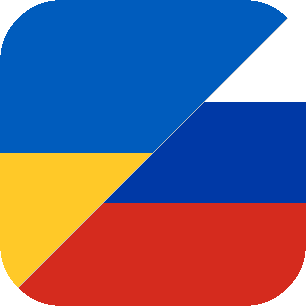

<div align="center">



# Russo-Ukrainian War Tracker

### [ukrainewar.app](https://ukrainewar.app)

**An immersive, real-time data visualization platform tracking the Russo-Ukrainian war through interactive maps, timelines, and comprehensive conflict data.**

[](https://github.com/engelde/ukrainewar/actions/workflows/ci.yml)
[](https://www.gnu.org/licenses/agpl-3.0)
[](https://nextjs.org)
[](https://typescriptlang.org)
[](https://tailwindcss.com)
[](https://workers.cloudflare.com)

---

*Built to inform, not to sensationalize. This project aims to provide accessible, data-driven insight into the human and material costs of the conflict.*

</div>

---

## Overview

The Russo-Ukrainian War Tracker is a dark-themed, map-centric web application that consolidates data from 8+ authoritative sources into a single interactive experience. Users can explore territory control changes, equipment losses, casualty statistics, humanitarian impact, and bilateral aid — all synchronized to a central timeline spanning the full duration of the war.

The entire interface is built around an explorable map rendered in muted dark tones, with data panels, counters, and visualizations layered on top. Every element is designed to put the data at the center of the experience.

---

## Features

### Interactive Map

- Full-screen **MapLibre GL** vector map with dark CartoDB base tiles
- **Territory control** overlays showing Russian-occupied areas over time
- **Frontline** visualization tracking the contact line
- **Equipment loss markers** — geotagged, categorized, and filterable by type and status
- **Conflict event heatmap** showing regional intensity
- **Major battle locations** with historical context
- **Ukraine border** and oblast boundary layers
- All layers independently toggleable via layer controls

### Central Timeline

- Scrubable timeline spanning **February 24, 2022 to present**
- **Playback controls** with adjustable speed (0.25× – 4×)
- **38 key events** with descriptions and map coordinates
- **Waveform visualization** showing daily Russian loss intensity
- Event hover tooltips with full details
- URL state persistence — shareable timeline positions

### Live Statistics

- **Animated counters** for Russian military losses:
  - Personnel, tanks, armored vehicles, artillery systems
  - MLRS, UAVs, air defense systems, jets, helicopters
  - Ships/boats, supply vehicles
- **Sparkline trend charts** showing recent daily trends
- Data sourced from the Ukrainian Ministry of Defence

### Event Sidebar

- Chronological event browser with **38 major war events**
- Filterable by category: Battles, Territory, Political, Military, Humanitarian, Milestones
- Click-to-navigate: selecting an event jumps the timeline and map
- Auto-tracking during timeline playback

### Bilateral Aid Panel

- **Kiel Institute Ukraine Support Tracker** data (Release 27)
- Total aid breakdown: Military, Financial, Humanitarian (EUR billions)
- **Top donor countries** ranked by total commitment (EU members highlighted)
- **Monthly allocation trends** with cumulative totals
- **Top 15 weapons delivered** by category

### Humanitarian Panel

- **UNHCR refugee data** — total refugees by year, top destination countries, IDPs
- **OCHA funding status** — humanitarian appeal requirements vs. actual funding
- **Civilian casualty data** — by oblast and month (ACLED)

### Equipment Loss Detail

- Click any equipment marker for detailed information
- Equipment type, model, status (destroyed/damaged/captured/abandoned)
- Date, nearest location, and coordinates
- Color-coded by status: red (destroyed), orange (damaged), green (captured), purple (abandoned)

### URL State Management

- Timeline date, map position (lat/lng/zoom), and sidebar state persisted in URL
- Every view is shareable and bookmarkable via [nuqs](https://nuqs.47ng.com/)

---

## Tech Stack

| Category | Technology |
|----------|-----------|
| **Framework** | [Next.js 16](https://nextjs.org) (App Router) |
| **Language** | [TypeScript 5](https://typescriptlang.org) |
| **UI Library** | [React 19](https://react.dev) |
| **Styling** | [Tailwind CSS 4](https://tailwindcss.com) |
| **Components** | [shadcn/ui](https://ui.shadcn.com) |
| **Maps** | [MapLibre GL](https://maplibre.org) |
| **Icons** | [react-icons](https://react-icons.github.io/react-icons/) (Tabler + Game Icons) |
| **URL State** | [nuqs](https://nuqs.47ng.com/) |
| **Fonts** | [DM Sans](https://fonts.google.com/specimen/DM+Sans) + [DM Mono](https://fonts.google.com/specimen/DM+Mono) |
| **Linting** | [Biome](https://biomejs.dev) |
| **Git Hooks** | [Husky](https://typicode.github.io/husky/) + [commitlint](https://commitlint.js.org/) |
| **Versioning** | [Release Please](https://github.com/googleapis/release-please) |
| **Deployment** | [Cloudflare Workers](https://workers.cloudflare.com) via [OpenNextJS](https://opennext.js.org/cloudflare) |

---

## Data Sources

This project aggregates data from the following authoritative sources. All data is accessed through publicly available APIs and datasets.

| Source | Data Provided | Link |
|--------|--------------|------|
| **WarSpotting** | Visually confirmed Russian equipment losses with geolocation | [warspotting.net](https://warspotting.net) |
| **Ukrainian Ministry of Defence** | Official daily personnel and equipment loss reports | [mil.gov.ua](https://www.mil.gov.ua) |
| **DeepState Map** | Territory control and frontline GeoJSON data | [deepstatemap.live](https://deepstatemap.live) |
| **ACLED** | Armed conflict event data — battles, civilian targeting, protests | [acleddata.com](https://acleddata.com) |
| **HDX / OCHA** | Humanitarian response data, civilian casualties, funding status | [data.humdata.org](https://data.humdata.org) |
| **UNHCR** | Refugee and internally displaced persons statistics | [data.unhcr.org](https://data.unhcr.org) |
| **Kiel Institute** | Ukraine Support Tracker — bilateral military, financial, and humanitarian aid | [ifw-kiel.de](https://www.ifw-kiel.de/topics/war-against-ukraine/ukraine-support-tracker/) |
| **VIINA** | Territorial control derived from news coverage (Zhukov & Ayers) | [github.com/zhukovyuri/VIINA](https://github.com/zhukovyuri/VIINA) |

### Data Freshness

| Dataset | Cache Duration | Update Frequency |
|---------|---------------|-----------------|
| Equipment stats | 1 hour | Hourly |
| Recent losses | 6 hours | Multiple times daily |
| Casualty reports | 4 hours | Daily |
| Territory control | 12 hours | Daily |
| Conflict events | 24 hours | Daily |
| Bilateral aid | 7 days | Monthly releases |
| VIINA territory | Weekly | Weekly snapshots |

---

## Architecture

```
src/
├── app/
│   ├── api/                  # 18 Next.js API routes with intelligent caching
│   │   ├── acled/            # Conflict events + regional aggregation
│   │   ├── casualties/       # Personnel & equipment loss statistics
│   │   ├── humanitarian/     # Refugees, funding, civilian casualties
│   │   ├── losses/           # Equipment loss data (stats, recent, trends)
│   │   ├── spending/         # Bilateral aid from Kiel Institute
│   │   └── territory/       # Territory control (DeepState + VIINA)
│   ├── page.tsx              # Home page (server component)
│   ├── layout.tsx            # Root layout with metadata + JSON-LD
│   └── globals.css           # OKLCH color palette + dark theme
│
├── components/
│   ├── layout/               # AppShell, Header, NavMenu, EventSidebar
│   ├── map/                  # MapView, TimelineScrubber, LayerControls
│   ├── stats/                # StatsOverlay, AnimatedCounter, Sparkline
│   ├── spending/             # SpendingPanel (bilateral aid)
│   ├── humanitarian/         # HumanitarianPanel (refugees, funding)
│   └── ui/                   # shadcn/ui base components
│
├── data/                     # Static data (events, battles, GeoJSON)
├── lib/                      # API clients, constants, types, utilities
└── hooks/                    # Custom React hooks

workers/
└── data-refresh/             # Cloudflare Worker cron for data updates

scripts/                      # Data processing (Kiel XLSX, ACLED, VIINA)
```

---

## Color Palette

The UI uses a custom **OKLCH** color palette optimized for dark mode data visualization.

| Color | OKLCH Value | Usage |
|-------|-----------|-------|
|  Background | `oklch(0.07 0.005 270)` | Page background |
|  Card | `oklch(0.12 0.008 270)` | Panel backgrounds |
|  Primary | `oklch(0.58 0.18 250)` | Interactive elements |
|  Accent | `oklch(0.85 0.17 85)` | Highlights, Ukraine yellow |
|  UA Blue | `oklch(0.48 0.18 250)` | Ukraine blue |
|  UA Yellow | `oklch(0.87 0.17 85)` | Ukraine yellow |
|  Destruction | `oklch(0.6 0.22 25)` | Destroyed equipment |
|  Damage | `oklch(0.72 0.17 55)` | Damaged equipment |
|  Capture | `oklch(0.64 0.17 155)` | Captured equipment |
|  Abandoned | `oklch(0.58 0.17 300)` | Abandoned equipment |
|  Occupation | `oklch(0.42 0.18 25)` | Occupied territory |

---

## Getting Started

### Prerequisites

- [Node.js 22+](https://nodejs.org/) (pinned via `.node-version`)
- npm 10+

### Installation

```bash
git clone https://github.com/engelde/ukrainewar.git
cd ukrainewar
npm install
```

### Development

```bash
npm run dev
```

Open [http://localhost:3000](http://localhost:3000) to view the application.

### Available Scripts

| Script | Description |
|--------|-------------|
| `npm run dev` | Start development server (Turbopack) |
| `npm run build` | Production build |
| `npm run lint` | Run Biome linter |
| `npm run lint:fix` | Auto-fix linting issues |
| `npm run format` | Format code with Biome |
| `npm run typecheck` | TypeScript type checking |
| `npm run data:update` | Process all data sources |
| `npm run build:worker` | Build for Cloudflare Workers |
| `npm run deploy` | Deploy to Cloudflare Workers |

---

## Deployment

The application is deployed to [Cloudflare Workers](https://workers.cloudflare.com) using [OpenNextJS Cloudflare](https://opennext.js.org/cloudflare).

```bash
npm run build:worker
npm run deploy
```

A separate Cloudflare Worker handles scheduled data refresh via cron triggers.

---

## Contributing

Contributions are welcome. Please note:

1. This project uses **conventional commits** enforced by commitlint
2. All code is linted and formatted by **Biome** (pre-commit hook)
3. PRs must pass CI checks (lint, typecheck, build)

```bash
# Example commit
git commit -m "feat: add population displacement chart"

# Commit types: feat, fix, docs, style, refactor, perf, test, build, ci, chore
```

---

## Attribution

**Created and maintained by [David Engel](https://github.com/engelde)**

This project relies on publicly available data from the sources listed above. Each data source retains its own licensing terms. The ACLED dataset is used under [CC-BY 4.0](https://creativecommons.org/licenses/by/4.0/). Kiel Institute data is from the publicly available Ukraine Support Tracker. UNHCR and OCHA data are provided through their respective open data portals.

If you use this project in academic work, please cite:

```
Engel, D. (2026). Russo-Ukrainian War Tracker [Web application].
https://ukrainewar.app. Source code: https://github.com/engelde/ukrainewar
```

---

## License

This project is licensed under the **GNU Affero General Public License v3.0** (AGPL-3.0).

This means you are free to:
- **Use** — run the application for any purpose
- **Study** — read and learn from the source code
- **Modify** — adapt and build upon this work
- **Share** — distribute copies

Under the following conditions:
- **Source disclosure** — if you deploy a modified version, you must make the source code available
- **Same license** — derivative works must be licensed under AGPL-3.0
- **Attribution** — you must give appropriate credit

See [LICENSE.txt](LICENSE.txt) for the full license text.

---

<div align="center">

**[ukrainewar.app](https://ukrainewar.app)** · Built with data, designed for understanding.

*This project is an independent effort and is not affiliated with any government or military organization.*

</div>
